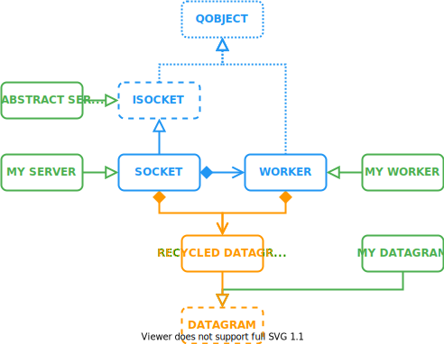

# NetUdp


NetUdp provide a Udp Socket that can send and receive Datagram.

* Support Unicast/Multicast/Broadcast Datagram.
* C++ and Qml API.
* Watcher that restart internal socket if something went wrong with the operating system.

## 🚀 Overview

<p align="center">
  
</p>

### Introduction

The two main classes that work out of the box are `Socket` and `RecycledDatagram`. Simply create a server, start it. Then send and receive datagrams. The server can join multicast group to receice multicast packets.

The `Socket` use a `Worker` that can run on separate thread or in main thread.

Every datagram allocation is stored in `std::shared_ptr<Datagram>`. This allow to reuse datagram object structure already allocated later without reallocating anything.

* `ISocket` can be inherited to represent a `Socket` without any functionality.

* `Socket` and `Worker` can be inherited to implement custom communication between server and worker. For example sending custom objects that can be serialized/deserialized in worker thread.

* `Datagram` can be inherited if a custom data container if required. For example if data is already serialized in a structure. Putting a reference to that structure inside the `Datagram` avoid a copy to `RecycledDatagram`.

### Dependencies

* The library depends on C++ 14 STL.
* [Recycler](https://github.com/OlivierLDff/Recycler.git) library to reuse allocated datagram.
* spdlog to log.
* Qt Core Qml Network for the backend.
* Qt dependencies:
  * Core, Network, Qml

### Tools

* [CMake](https://cmake.org/) v3.14 or greater.
* C++17 compliant compiler or greater.
* Internet connection to download dependencies from *Github* during configuration.

## C++ Usage

A Basic Client/Socket can be found in `examples/EchoClientServer.cpp`.

### 🌍 Server

This example demonstrate how to create a server that send datagram to address `127.0.0.1` on port `9999`.

```cpp
#include <Net/Udp/NetUdp.hpp>

int main(int argc, char* argv[])
{
    QCoreApplication app(argc, argv);

    net::udp::Socket server;
    server.start();
    const std::string data = "Dummy Data";
    server.sendDatagram(data.c_str(), data.length()+1, "127.0.0.1", 9999);

    return QCoreApplication::exec();
}
```

> The datagram is emitted from a random port chosen by the operating system. It can be explicitly specified by calling `setTxPort(uint16_t)`.
>
> If the socket also receive datagram (ie `inputEnabled` is true and call `setRxPort`), then the rx port will use. To change this default behavior call `setSeparateRxTxSockets(true)`.

### Client

This example demonstrate how to receive a packet on address `127.0.0.1` on port `9999`.

```c++
#include <Net/Udp/NetUdp.hpp>

int main(int argc, char* argv[])
{
    QCoreApplication app(argc, argv);

    net::udp::Socket client;
    client.start("127.0.0.1", 9999);

    QObject::connect(&client, &net::udp::Socket::sharedDatagramReceived,
                     [](const net::udp::SharedDatagram& d)
    {
        qInfo("Rx : %s", reinterpret_cast<const char*>(d->buffer()));
    });

    return QCoreApplication::exec();
}
```

### 😞 Errors handling

Errors can be observed via `socketError(int error, QString description)` signals. If the socket fail to bind, or if anything happened, the worker will start a watchdog timer to restart the socket.

The default restart time is set to 5 seconds but can be changed via `watchdogPeriod` property. The property is expressed in milliseconds.

### Disable Input

By default, if internal socket is bounded to an interface with a port, the `Worker` will receive incoming datagram. To avoid receiving those datagram inside `Socket`, call `setInputEnabled(false)`.

### 👪 Multicast group

#### Multicast Reception

* `multicastGroups` is the list of multicast addresses that are listened.
  To join multicast group call `joinMulticastGroup(QString)`, `leaveMulticastGroup(QString)`, `leaveAllMulticastGroups`.
* `multicastListeningInterfaces`: Set the interfaces on which the socket is listening to `multicastGroups`. By default all interfaces are listened.
  Use `joinMulticastInterface`, `leaveMulticastInterface`, `leaveAllMulticastInterfaces` and `isMulticastInterfacePresent`.
* `multicastLoopback` Control if multicast datagram are looping in the system. On windows it should be set on receiver side. On Unix systems, it should be set on sender side.

#### Multicast Transmission

* `multicastOutgoingInterfaces`: Outgoing interfaces for multicast packet. If not specified, then packet is going to all interfaces by default to provide a plug and play experience.

### Statistics

Internally the `Socket` track multiple information to have an idea of what is going on.

* `isBounded` indicate if the socket is currently binded to a network interface.
* `*xBytesPerSeconds` is an average value of all bytes received/sent in the last second. This value is updated every seconds. `* can be replaced by t and r`
* `*xBytesTotal` total received/sent bytes since start. `* can be replaced by t and r`
* `*xPacketsPerSeconds` is an average value of all packets received/sent in the last second. This value is updated every seconds. `* can be replaced by t and r`
* `*xPacketsTotal` total received/sent packets since start. `* can be replaced by t and r`

Those property can be cleared with `clearRxCounter`/`clearTxCounter`/`clearCounters`.

### 📋 How to avoid memory copy

When calling any of the following function, a `memcpy` will happen to a `RecycledDatagram`.

```cpp
virtual bool sendDatagram(const uint8_t* buffer, const size_t length, const QHostAddress& address, const uint16_t port, const uint8_t ttl = 0);
virtual bool sendDatagram(const uint8_t* buffer, const size_t length, const QString& address, const uint16_t port, const uint8_t ttl = 0);
virtual bool sendDatagram(const char* buffer, const size_t length, const QHostAddress& address, const uint16_t port, const uint8_t ttl = 0);
virtual bool sendDatagram(const char* buffer, const size_t length, const QString& address, const uint16_t port, const uint8_t ttl = 0);
```

To avoid useless memory copy it's recommended to retrieve a datagram from `Socket` cache with `makeDatagram(const size_t length)`. Then use this `net::udp::SharedDatagram` to serialize data. And call :

```cpp
virtual bool sendDatagram(std::shared_ptr<Datagram> datagram, const QString& address, const uint16_t port, const uint8_t ttl = 0);
virtual bool sendDatagram(std::shared_ptr<Datagram> datagram);
```

### Customize ISocket

If you are not satisfied by `Socket` behavior, or if you want to mock `Socket` without any dependency to `QtNetwork`. It's possible to extend `ISocket` to use it's basic functionality.

* Managing list of multicast ip.
* start/stop behavior that clear counter and `isRunning`/`isBounded`.

You need to override:

* `bool start()` : Start the socket. Auto restart to survive from error is expected. Don't forget to call `ISocket::start` at beginning.
* `bool stop()` : Stop the socket. Clear all running task, empty cache, buffers, etc... Don't forget to call `ISocket::stop` at beginning. To ensure maximum cleaning, always stop every even if stopping any part failed.
* `joinMulticastGroup(const QString& groupAddress)`: Implementation to join a multicast group. Don't forget to call `ISocket::joinMulticastGroup`.
* `leaveMulticastGroup(const QString& groupAddress)`: Implementation to leave a multicast group. Don't forget to call `ISocket::leaveMulticastGroup`.

```cpp
#include <Net/Udp/ISocket.hpp>

class MyAbstractSocket : net::udp::ISocket
{
    Q_OBJECT
public:
    MyAbstractSocket(QObject* parent = nullptr) : net::udp::ISocket(parent) {}

public Q_SLOTS:
    bool start() override
    {
        if(!net::udp::ISocket::start())
            return false;

        // Do your business ...

        return true;
    }
    bool stop() override
    {
        auto stopped = net::udp::ISocket::stop()

        // Do your business ...

        return stopped;
    }
    bool joinMulticastGroup(const QString& groupAddress) override
    {
        // Join groupAddress ...
        return true;
    }
    bool leaveMulticastGroup(const QString& groupAddress) override
    {
        // Leave groupAddress ...
        return true;
    }
}
```

### Customize Socket and Worker

`Socket` and `Worker` mainly work in pair, so if overriding one, it make often sense to override the other.

Reasons to override `Worker`:

* Implement a serialization/deserialization in a worker thread.
* Check if a datagram is valid with computation of crc, hash, etc... on every received datagram in worker thread.
* Compute crc, hash, ... for every outgoing datagram in worker thread.
* Use a custom `Datagram` class
* ...

Reasons to override `Socket`

* Use a custom `Worker` class.
* Use a custom `Datagram` class.
* ...

#### Customize Datagram

Using a custom `Datagram` can reduce memory copy depending on your application.

* To use custom datagram for Rx packet, customize `Worker`.
* To use custom datagram for Tx packet:
  * Call `Socket::sendDatagram(SharedDatagram, ...)` with it.
  * Customize `Socket` to use it when calling with `Socket::sendDatagram(const uint8_t*, ...)`.  *A `memcpy` will happen. So don't use a custom `Datagram` for that purpose.*

```cpp
#include <Net/Udp/Datagram.hpp>

class MyDatagram : net::udp::Datagram
{
    uint8_t* myBuffer = nullptr;
    size_t myLength = 0;
public:
    uint8_t* buffer() { return myBuffer; }
    const uint8_t* buffer() const { return myBuffer; }
    size_t length() const { return myLength; }
};
```

#### Customize Worker

When inheriting from `SocketWorker` you can override:

* `bool isPacketValid(const uint8_t* buffer, const size_t length) const`: Called each time a datagram is received. Check if a packet is valid depending on your protocol. Default implementation just return true. You can add a CRC check or something like that. Returning false here will increment the `rxInvalidPacketTotal` counter in `Socket`.
* `void onReceivedDatagram(const SharedDatagram& datagram)`: Called each time a valid datagram arrive. Default implementation emit `receivedDatagram` signal. Override this function to add a custom messaging system, or a custom deserialization.
* `std::shared_ptr<Datagram> makeDatagram(const size_t length)` : Create custom `Datagram` for rx.
* If you implement a custom serialization via a custom message system in `Worker`, call `void onSendDatagram(const SharedDatagram& datagram)` to send a datagram to the network.
* Don't forget that `SocketWorker` inherit from `QObject`, so use `Q_OBJECT` macro to generate custom signals.

Example:

```cpp
#include <Net/Udp/Worker.hpp>

class MySocketWorker : net::udp::Worker
{
    Q_OBJECT
public:
    MySocketWorker(QObject* parent = nullptr) : net::udp::SocketWorker(parent) {}

public Q_SLOTS:
    bool std::unique_ptr<SocketWorker> createWorker() override
    {
        auto myWorker = std::make_unique<MyWorker>();

        // Init your worker with custom stuff ...
        // Even keep reference to MyWorker* if you need later access

        // It's recommended to communicate via signals to the worker
        // Connect here ...

        return std::move(myWorker);
    }

    // This is called before creating a SharedDatagram and calling onDatagramReceived
    bool isPacketValid(const uint8_t* buffer, const size_t length) const override
    {
        // Add your checks, like header, fixed size, crc, etc...
        return buffer && length;
    }

    void onDatagramReceived(const SharedDatagram& datagram) override
    {
        // Do your business ...

        // This super call is optionnal. If not done Socket will never trigger onDatagramReceived
        net::udp::SocketWorker::onDatagramReceived(datagram);
    }

    std::shared_ptr<Datagram> makeDatagram(const size_t length) override
    {
        // Return your custom diagram type used for rx
        return std::make_shared<MyDiagram>(length);
    }
}
```

> Customizing worker mostly make sense when it's running in a separate thread. Otherwise it won't give any performance boost. Don't forget to call `Socket::setUseWorkerThread(true)`.
>

#### Customize Socket

When inheriting from `Socket` you can override:

* `bool std::unique_ptr<SocketWorker> createWorker() const`: Create a custom worker.
* `void onDatagramReceived(const SharedDatagram& datagram)` : Handle datagram in there. Default implementation emit `datagramReceived` signals
* `std::shared_ptr<Datagram> makeDatagram(const size_t length)` : Create custom `Datagram` that will be used in `Socket::sendDatagram(const uint8_t*, ...)`.
* Don't forget that `Socket` inherit from `QObject`, so use `Q_OBJECT` macro to generate custom signals.

Example:

```cpp
#include <Net/Udp/Socket.hpp>

class MySocket : net::udp::Socket
{
    Q_OBJECT
public:
    MySocket(QObject* parent = nullptr) : net::udp::Socket(parent) {}

public Q_SLOTS:
    bool std::unique_ptr<Worker> createWorker() override
    {
        auto myWorker = std::make_unique<MyWorker>();

        // Init your worker with custom stuff ...
        // Even keep reference to MyWorker* if you need later access

        // It's recommended to communicate via signals to the worker
        // Connect here ...

        return std::move(myWorker);
    }

    void onDatagramReceived(const SharedDatagram& datagram) override
    {
        // Do your business ...

        // This super call is optionnal. If not done Socket will never trigger datagramReceived signal
        net::udp::Socket::onDatagramReceived(datagram);
    }

    std::shared_ptr<Datagram> makeDatagram(const size_t length) override
    {
        // Return your custom diagram type used for tx
        return std::make_shared<MyDiagram>(length);
    }
}
```

## Examples

### EchoClientServer

This example demonstrate an echo between a server and a client. Socket send a packet to a client, the client reply the same packet. `Ctrl+C` to quit.

```bash
$> NetUdp_EchoClientServer --help

Options:
  -?, -h, --help    Displays this help.
  -t                Make the worker live in a different thread. Default false
  -s, --src <port>  Port for rx packet. Default "11111".
  -d, --dst <port>  Port for tx packet. Default "11112".
  --src-addr <ip>   Ip address for server. Default "127.0.0.1"
  --dst-addr <ip>   Ip address for client. Default "127.0.0.1"

$> NetUdp_EchoClientServer
> app: Init application
> server: Set Rx Address to 127.0.0.1
> server: Set Rx Port to 11111
> client: Set Rx Address to 127.0.0.1
> client: Set Rx Port to 11112
> app: Start application
> client: Rx : Echo 0
> server: Rx : Echo 0
> client: Rx : Echo 1
> server: Rx : Echo 1
> client: Rx : Echo 2
> server: Rx : Echo 2
> ...
```

This example is also break into 2 examples : `NetUdp_EchoClient` & `NetUdp_EchoServer`.

### MulticastLoopbackSocket

Demonstrate how to join multicast ip group. Send a packet and read it back via loopback.

```bash
$> NetUdp_EchoMulticastLoopback --help
Options:
  -?, -h, --help          Displays this help.
  -t                      Make the worker live in a different thread. Default
                          false
  -p                      Print available multicast interface name
  -s, --src <port>        Port for rx packet. Default "11111".
  -i, --ip <ip>           Ip address of multicast group. Default "239.0.0.1"
  --if, --interface <if>  Name of the iface to join. Default is os dependent

```

## Qml Usage

* `net::udp::registerQmlTypes();` should be called in the main to register qml types.

### Unicast Datagram

This example show how to send a unicast datagram as a string to `127.0.0.1:9999`. Don't forget to start the socket before sending any messages.

```js
import QtQuick 2.0
import QtQuick.Controls 2.0

import NetUdp 1.0 as NetUdp

Button
{
  text: "send unicast"
  onClicked: () => socket.sendDatagram({
    address: "127.0.0.1",
    port: 9999,
    data: "My Data"
    // Equivalent to 'data: [77,121,32,68,97,116,97]'
  })

  NetUdp.Socket
  {
    id: socket
    Component.onCompleted: () => start()
  }
}
```

This example show how to receive the datagram. Don't forget to start listening to an address and a port. The datagram is always received as a string. It can easily be decoded to manipulate a byte array.

```js
import NetUdp 1.0 as NetUdp

NetUdp.Socket
{
  onDatagramReceived: function(datagram)
  {
    console.log(`datagram : ${JSON.stringify(datagram)}`)
    console.log(`datagram.data (string) : "${datagram.data}"`)
    let byteArray = []
    for(let i = 0; i < datagram.data.length; ++i)
      byteArray.push(datagram.data.charCodeAt(i))
    console.log(`datagram.data (bytes): [${byteArray}]`)

    console.log(`datagram.destinationAddress : ${datagram.destinationAddress}`)
    console.log(`datagram.destinationPort : ${datagram.destinationPort}`)
    console.log(`datagram.senderAddress : ${datagram.senderAddress}`)
    console.log(`datagram.senderPort : ${datagram.senderPort}`)
    console.log(`datagram.ttl : ${datagram.ttl}`)
  }

  Component.onCompleted: () => start("127.0.0.1", 9999)
}
```

### Multicast Datagram

Send multicast datagram work almost the same as unicast. Only difference is that you control on which interface the data is going.

```js
import NetUdp 1.0 as NetUdp

NetUdp.Socket
{
  id: socket
  // A Packet will be send to each interface
  // The socket monitor for interface connection/disconnection
  multicastOutgoingInterfaces: [ "lo", "eth0" ]
  // Required in unix world if you want loopback on the same system
  multicastLoopback: true

  Component.onCompleted: () => start()
}
```

Then send data like in unicast:

```js
socket.sendDatagram({
  address: "239.1.2.3",
  port: 9999,
  data: "My Data"
})
```

To receive it, subscribe the to the multicast group and choose on which interfaces.

```js
import NetUdp 1.0 as NetUdp

NetUdp.Socket
{
  multicastGroups: [ "239.1.3.4" ]
  multicastListeningInterfaces: [ "lo", "eth0" ]

  // Required in the windows world if you want loopback on the same system
  multicastLoopback: true

  onDatagramReceived: (datagram) => console.log(`datagram : ${JSON.stringify(datagram)}`)

  // Listen port 9999
  Component.onCompleted: () => start(12999934)
}
```
### Debug

This library also provide a tool object that demonstrate every Qmls functionality. This is intended for quick debug, or test functionalities if UI isn't built yet.


In order to use this qml object into another qml file, multiple steps are required.

* Call `net::udp::registerQmlTypes(...)` to register `Socket`, `SharedDatagram`, ... to the qml system
* Call `net::udp::loadQmlResources()` to load every `NetUdp` resources into the `qrc`.

Then simply to something like that:

```js
import NetUdp.Debug 1.0 as NetUdpDebug
import NetUdp 1.0 as NetUdp

Rectangle
{
    property NetUdp.Socket socket
    NetUdpDebug.Socket
    {
        object: socket
    }
}
```

`NetUdp.Debug.Socket` is a `Qaterial.DebugObject`. If you want the raw content to display it somewhere else, then use `NetUdp.Debug.SocketContent` that is a `Column`.

## Configuring

This library use CMake for configuration.

```bash
git clone https://github.com/OlivierLDff/NetUdp
cd NetUdp
mkdir build && cd build
cmake ..
```

The `CMakeLists.txt` will download every dependencies for you.

## 🔨 Building

Simply use integrated cmake command:

```bash
cmake --build . --config "Release"
```

## Add to CMake build

Adding NetUdp library in your library is really simple if you use CMake 3.14.

In your `CMakeLists.txt`:

```cmake
# ...
include(FetchContent)
FetchContent_Declare(
    NetUdp
    GIT_REPOSITORY "https://github.com/OlivierLDff/NetUdp"
    GIT_TAG        "master"
)
# ...
FetchContent_MakeAvailable(NetUdp)
# ...

target_link_libraries(MyTarget PRIVATE NetUdp)
```

Then you just need to `#include <Net/Udp/NetUdp.hpp>`. You should also call in your main : `net::udp::registerQmlTypes();`.

## Changelog

### v1.2.2

* 🐛 Fix reset Datagram. (ttl is now always reset to 0)
* 🔊 Log more info about fail send datagram

### v1.2.1

* 🐛 Fix compilation with pch disabled (cmake < 3.17)
* 🔊 Log missing cmake info : `NETUDP_ENABLE_PCH`, `NETUDP_ENABLE_EXAMPLES`, `NETUDP_ENABLE_TESTS`

### v1.2.0

* Allow to resize datagram with `resize` method.
* Update NetUdp.Debug to comply with Qaterial v1.4
* 🐛 SocketWorker: Fix potential nullptr access
* 🐛 Fix compilation with -DNETUDP_ENABLE_QML=OFF

### v1.1

* Introduce `multicastOutgoingInterfaces` instead of `multicastInterfaceName`. If `multicastOutgoingInterfaces` is empty packets are going to be send on every interfaces.
* Remove `multicastListenOnAllInterfaces` and make it the default when `multicastListeningInterfaces` is empty.
* QML API/Examples.
* Unit Tests.

### v1.0

* Initial work

## Authors

* [Olivier Le Doeuff](https://github.com/OlivierLDff)
